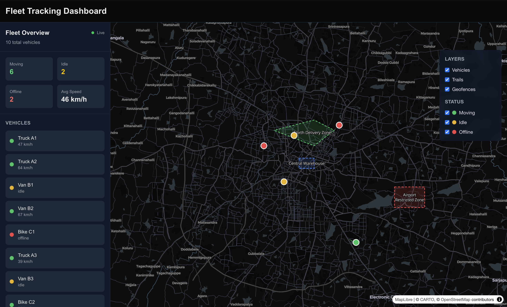

# Fleet Tracking Dashboard

Real-time fleet tracking dashboard built with MapLibre GL JS, Next.js, and native WebSockets. Simulates a fleet of vehicles with live GPS updates, server-side geofence detection, historical trail visualization, and production-grade connection handling.



**Live Demo:** [fleet-tracking-dashboard-flax.vercel.app](https://fleet-tracking-dashboard-flax.vercel.app/)
**API:** [fleet-tracking-dashboard-production.up.railway.app/health](https://fleet-tracking-dashboard-production.up.railway.app/health)

---

## Overview

Most map demos fall over at ~100 markers or break the moment the connection flickers. This project is built the way a real fleet tracking app is built — GPU-rendered layers instead of DOM markers, WebSocket with reconnection and heartbeat, REST for historical queries, server-side geofence detection.

## Features

- **Real-time vehicle tracking** — Live GPS updates over WebSocket at 1s intervals
- **Clustering** — Thousands of vehicles handled smoothly via GPU-rendered circle layers
- **Geofences** — Server-side point-in-polygon detection with enter/exit alerts pushed over WebSocket
- **Vehicle trails** — Live breadcrumb trails showing recent movement
- **Historical paths** — Click any vehicle to fetch its full route from the REST API
- **Layer controls** — Toggle vehicles, trails, and geofences; filter by status (moving/idle/offline)
- **Connection status** — Live indicator with colored states: Live, Reconnecting, Disconnected
- **Fleet stats** — Real-time aggregates: moving count, idle count, average speed

## Architecture

```
┌──────────────────┐   WSS + HTTPS   ┌────────────────────┐
│   Vercel         │  ─────────────► │   Railway          │
│   Next.js 16     │                 │   Node + ws        │
│   MapLibre GL    │                 │   + Express        │
│   WebSocket hook │                 │   + Turf.js        │
└──────────────────┘                 └────────────────────┘
```

The frontend runs on Vercel. The backend is a single Node.js process on Railway that serves REST (via Express) and WebSocket (via `ws`) on the same HTTP port. The WS server attaches to the same HTTP server Express uses, so one port handles both.

## Tech Stack

**Frontend**
- Next.js 16, React 19, TypeScript
- Tailwind CSS
- MapLibre GL JS (vector tiles rendered on the GPU via WebGL)
- Native browser WebSocket API (no Socket.io)

**Backend**
- Node.js
- `ws` — WebSocket server
- Express — REST API
- Turf.js — geospatial analysis (point-in-polygon, GeoJSON operations)

**Hosting**
- Vercel (frontend)
- Railway (backend)

## Technical Highlights

### Performance
- **GeoJSON source + circle layers** instead of `maplibregl.Marker` — DOM markers don't scale past ~100 points. WebGL layers render thousands without frame drops.
- **Split `useEffect` pattern** — one effect sets up sources and layers once, a second effect calls `source.setData()` on every update. Avoids re-creating the layer pipeline on every render.
- **Native clustering** — MapLibre's built-in supercluster algorithm, no external library.
- **Capped in-memory state** — vehicle trails (50 points), alert history (500 records), vehicle history (1000 points) — prevents unbounded growth.

### Real-time Reliability
- **Exponential backoff reconnection** — retry at 1s, 2s, 4s, 8s, up to 30s, with ±25% jitter to prevent thundering herd on server restart.
- **Application-level heartbeat** — server pings every 25s, client expects ping within 35s. Detects silent connection drops (laptop sleep, proxy timeouts, server crashes) that `onclose` won't fire for.
- **Graceful shutdown** — server handles SIGTERM, cleanly closes all WebSocket clients with code 1001, then exits. Enables zero-downtime deploys.
- **Pub-sub via browser events** — multiple React hooks share one WebSocket connection by re-dispatching messages as `CustomEvent`s on `window`.

### Architecture Decisions
- **WebSocket for live state, REST for historical queries.** Each tool for its strength — WS is wrong for one-time queries, REST is wrong for push-based updates.
- **Server-side geofence detection.** Running point-in-polygon on the server (not client) ensures consistent rules across all dashboards, can't be bypassed, and scales better — one computation broadcast to many clients.
- **Typed messages with a `type` field.** Every WebSocket message has a discriminator. Client switches on type to route to the right handler. Same pattern as Slack, Discord, AWS API Gateway.
- **Native WebSocket over Socket.io.** For this use case, the protocol-level control matters more than Socket.io's convenience features. Also smaller bundle.

## Project Structure

```
fleet-tracking-dashboard/
├── app/
│   ├── components/
│   │   ├── Map.tsx              # Main map container
│   │   ├── VehicleMarkers.tsx   # Clustered vehicle layer
│   │   ├── VehicleTrails.tsx    # Live breadcrumb trails
│   │   ├── HistoryTrail.tsx     # Historical path (from REST)
│   │   ├── Geofences.tsx        # Zone polygons with labels
│   │   ├── LayerControls.tsx    # Visibility + status filters
│   │   ├── AlertsPanel.tsx      # Geofence event notifications
│   │   └── Sidebar.tsx          # Fleet stats + vehicle list
│   ├── hooks/
│   │   ├── useVehicleSocket.ts  # WebSocket connection + reconnect logic
│   │   └── useGeofenceAlerts.ts # Subscribes to geofence events
│   ├── lib/
│   │   └── api.ts               # Typed REST API client
│   └── data/
│       └── vehicles.ts          # Type definitions
└── server/
    ├── wsServer.ts              # Unified HTTP + WebSocket server
    └── tsconfig.json            # Separate TS config for Node
```

## REST API

| Method | Path | Description |
|--------|------|-------------|
| `GET` | `/health` | Service health check |
| `GET` | `/api/vehicles` | Current state of all vehicles |
| `GET` | `/api/vehicles/:id/history?limit&since` | Historical positions for a vehicle |
| `GET` | `/api/geofences` | All defined geofences |
| `GET` | `/api/alerts?limit&vehicleId&type` | Recent geofence enter/exit events |

## WebSocket Protocol

**Server → Client**

```ts
{ type: "welcome", data: { vehicleCount, updateInterval } }
{ type: "vehicle-update", data: Vehicle[], timestamp }
{ type: "geofence-alert", data: GeofenceEvent }
{ type: "ping", timestamp }
```

**Client → Server**

```ts
{ type: "pong", timestamp }
```

## Running Locally

```bash
# Install
npm install

# Terminal 1: start backend (REST + WebSocket on port 8080)
npm run ws

# Terminal 2: start Next.js frontend
npm run dev
```

Open http://localhost:3000.

## Environment Variables

Frontend (`.env.local`):

```
NEXT_PUBLIC_API_URL=http://localhost:8080
NEXT_PUBLIC_WS_URL=ws://localhost:8080
```

Backend (production):

```
PORT=8080
ALLOWED_ORIGINS=https://your-frontend-domain.vercel.app
```

## Deployment

- **Frontend** — pushed to `main`, Vercel auto-deploys on every commit. Env vars are baked into the build at build time (note the `NEXT_PUBLIC_` prefix) so env var changes require a redeploy.
- **Backend** — Railway builds with `npm run ws:build` and runs `npm run ws:start`. Health check at `/health` lets Railway auto-restart the service if it goes unresponsive.

## What I'd Do Next

Given more time, the obvious next steps:

- **Persist to a database** (PostgreSQL + PostGIS) instead of in-memory state — survives restarts, enables longer history queries
- **Horizontal scaling** — move WebSocket state to Redis pub/sub so multiple backend instances share connections
- **Vehicle filtering by viewport** — server returns only vehicles currently visible on the map, reduces payload at scale
- **Web Workers** for building GeoJSON off the main thread at very large scale (10k+ vehicles)
- **Authentication** — JWT on WebSocket connect, role-based access for zones/vehicles

---

Built as a portfolio project to dive deep into MapLibre GL JS, real-time systems, and production deployment patterns.
